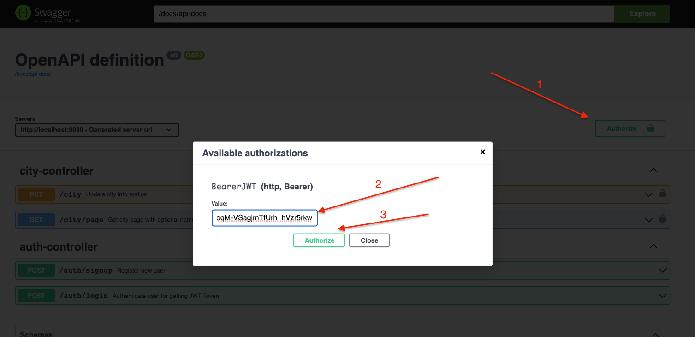
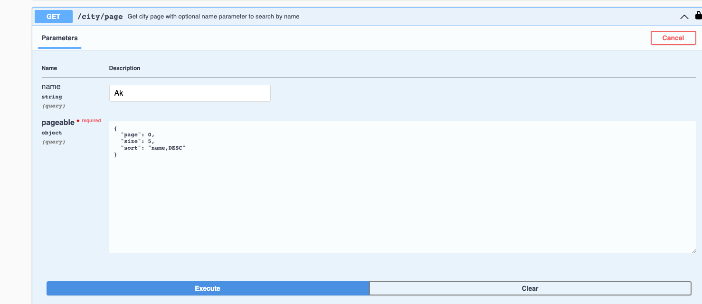

#Kuehne-Nagel test assignment#
##Outline
###1-Prerequisites and Running
####1.1 Running with docker & docker-compose (recommended for almost zero effort)
####1.2 Running without docker
###2-Testing ###
###3-Extra Notes###

---
###1-Prerequisites
Firstly be sure that no application is running on ports :`3307`, `8080` and `3000`.

**MySQL database** will work on: `3307`

**Backend app** will work on: `8080`

**Frontend app** will work on: `3000`

Install Docker & Docker-Compose (Docker):

https://docs.docker.com/get-docker/

https://docs.docker.com/compose/install/

####1.1 Running with docker & docker-compose **(recommended for almost zero effort)**

**1-** When you install docker & docker-compose, go to project main folder where the docker-compose.yml is located.

**2-** Run the command ```docker-compose up -d```.

**3-** You should wait around 2-3 minutes so that the projects will install required dependencies
and build the project and then will be ready to run.

**4-** When project are ready (3 containers: `knmysql`, `knbackend` and `knfrontend` are working correctly)
You can go to `localhost:3000`. Here is the login page. You can login or register new user to sign in.

**5-** You can see swagger/open-api UI to test backend with requests without frontend ui on
http://localhost:8080/docs/swagger-ui/index.html

####1.2 Running without docker

You can download and install MySQL and create db with following credentials:
`jdbcUrl=jdbc:mysql://localhost:3307/knmysql
username=kntestuser
password=kntestpass`

Run the backend project from local (through IDE or `java -jar knbackend.jar` after building backend project with `mvn package`)

Run the frontend project from local (through IDE or `npm start` after building frontend project with `npm install`)

---

###2-Testing ###

You can test the app through frontend (`localhost:3000`) or you can test the backend via swagger/open-api ui on
http://localhost:8080/docs/swagger-ui/index.html

In order to be able to see pages you need to login first (or register if you are not logged in).
For swagger-ui testers: You need to login and get the jwtToken response first 
and then paste that token to the `authorization` field on top right corner as follows:


---
###3-Extra Notes ###
System has 2 users by default:

**1-** Username: **EDITOR** Password: **123456qwe** Role: **ROLE_ALLOW_EDIT**

**2-** Username: **READER** Password: **123456qwe** Role: **ROLE_DISALLOW_EDIT**

You can edit name or photo links of cities only if you have **ROLE_ALLOW_EDIT** role.

For registering new user, password complexity policy is:
```
at least 4 characters
at least one upper-case character
at least one digit character
no whitespace
```
If you want to change that behaviour you can edit the
`knbackend/src/main/java/com/kntest/knbackend/util/PasswordConstraintValidator.java` file 
and comment/uncomment desired behaviours.

"Sorting" was not included in the task, but it works on backend due to 
default behaviour of "Pageable" object. Sample request is:

